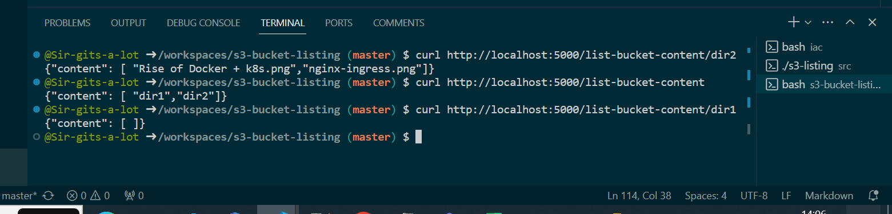

# s3-bucket-listing
A small webserver written in golang using the gorilla mux and aws sdk packages to list the content of S3 bucket in aws account deployed in containerized environment with Terraform and Kubernetes.

# Steps to reproduce in local environment

1. Install aws cli
curl "https://awscli.amazonaws.com/awscli-exe-linux-x86_64.zip" -o "awscliv2.zip"
unzip awscliv2.zip
sudo ./aws/install --bin-dir /usr/local/bin --install-dir /usr/local/bin/aws-cli --update

2. Configure aws credentials

Using aws configure command (Enter access key ID, secret access key, region and output format)

1. Run the source code locally to verify the functionality

cd src
go build -o s3-listing

./s3-listing {s3-bucket-name}
## Here s3-bucket-name is the s3 bucket in your aws account which you want to test against. If you don't provide, the code will run against default bucket name (unique-s3-bucket-123).

## In another terminal, run curl commands and verify the output with expected output

1. curl http://localhost:5000/list-bucket-content

## Expected output:- 

{"content": [ "dir1","dir2"]}

2. curl http://localhost:5000/list-bucket-content/dir1

## Expected Output:-

{"content": [ ]}

3. curl http://localhost:5000/list-bucket-content/dir2

## Expected Output:-

{"content": [ "Rise of Docker + k8s.png","nginx-ingress.png"]}

1. Install aws cli
curl "https://awscli.amazonaws.com/awscli-exe-linux-x86_64.zip" -o "awscliv2.zip"
unzip awscliv2.zip
sudo ./aws/install --bin-dir /usr/local/bin --install-dir /usr/local/bin/aws-cli --update

2. Install Docker

for pkg in docker.io docker-doc containerd runc; do sudo apt-get remove $pkg; done

# Add Docker's official GPG key:
sudo apt-get update
sudo apt-get install ca-certificates curl
sudo install -m 0755 -d /etc/apt/keyrings
sudo curl -fsSL https://download.docker.com/linux/ubuntu/gpg -o /etc/apt/keyrings/docker.asc
sudo chmod a+r /etc/apt/keyrings/docker.asc

# Add the repository to Apt sources:
echo \
  "deb [arch=$(dpkg --print-architecture) signed-by=/etc/apt/keyrings/docker.asc] https://download.docker.com/linux/ubuntu \
  $(. /etc/os-release && echo "$VERSION_CODENAME") stable" | \
  sudo tee /etc/apt/sources.list.d/docker.list > /dev/null
sudo apt-get update

# Install docker
sudo apt-get install docker-ce docker-ce-cli containerd.io

# Run these linux post-install scripts

sudo groupadd docker; sudo usermod -aG docker $USER; newgrp docker;

## Log out and log back in so that your group membership is re-evaluated.

## If you're running Linux in a virtual machine, it may be necessary to restart the virtual machine for changes to take effect.

3. Build the docker image for the application and push to ephemeral registry
(Useful for pushing to ephemeral registry)

Build docker image with tag ttl.sh/s3-listing:24h

cd src  && docker build -t ttl.sh/kvstore:24h . --no-cache
docker push ttl.sh/kvstore:24h

4. Install Terraform
sudo apt-get update && sudo apt-get install -y gnupg software-properties-common

wget -O- https://apt.releases.hashicorp.com/gpg | \
gpg --dearmor | \
sudo tee /usr/share/keyrings/hashicorp-archive-keyring.gpg > /dev/null

echo "deb [signed-by=/usr/share/keyrings/hashicorp-archive-keyring.gpg] \
https://apt.releases.hashicorp.com $(lsb_release -cs) main" | \
sudo tee /etc/apt/sources.list.d/hashicorp.list

sudo apt update
sudo apt-get install terraform

5. Provision Infrastructure using Terraform

cd iac
terraform init
terraform validate
terraform plan -out=tfplan
terraform apply tfplan --auto-approve

## After successfully validating
terraform destroy

## Screenshots for refernce

